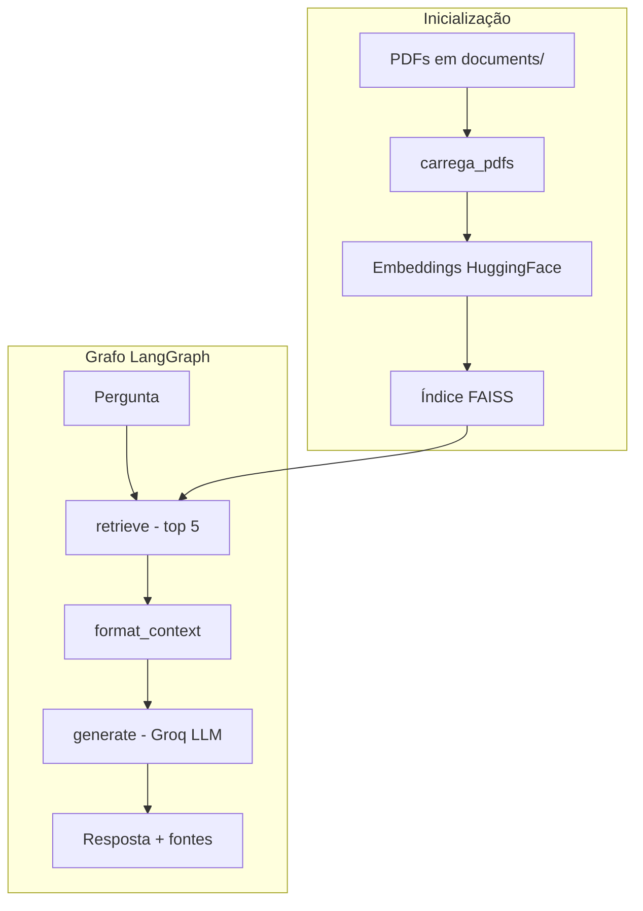

# AgenticRag_Retriever

Assistente CLI em português para responder perguntas sobre contratos PDF usando **RAG** (Retrieval-Augmented Generation). O sistema indexa documentos localmente, recupera os trechos mais relevantes e gera respostas com um LLM via Groq.

> Apesar do nome "Agentic", o fluxo atual é um **pipeline RAG linear** (retrieve → format → generate), sem ferramentas externas nem loops de decisão.

## Arquitetura



### Stack

| Componente | Tecnologia |
|------------|------------|
| Orquestração | LangGraph |
| LLM | Groq — `llama-3.3-70b-versatile` |
| Embeddings | HuggingFace — `all-MiniLM-L6-v2` |
| Vector store | FAISS (local) |
| Documentos | LangChain + PyPDF |

## Pré-requisitos

- Python 3.10+
- Chave de API da [Groq](https://console.groq.com/)

## Instalação

```bash
git clone <url-do-repositorio>
cd AgenticRag_Retriever

python -m venv .venv
source .venv/bin/activate        # Linux/macOS
# .venv\Scripts\activate         # Windows

pip install -r requirements.txt

cp .env.example .env
# Edite .env e defina sua GROQ_API_KEY
```

## Uso

1. Coloque os PDFs de contrato na pasta `documents/`.
2. Execute o agente:

```bash
python -m src
```

3. Faça perguntas no terminal. Digite `sair` para encerrar.

### Exemplo de interação

```
--- Inicializando o Agente de Contratos ---
Carregando Vector Store existente: .../database/vectordb
Vector Store carregado

--- Executando Agente de Contratos ---

Digite sua pergunta sobre os contratos (ou digite 'sair' para encerrar):
> Qual é o valor do contrato?

--- Resposta Final ---
O valor do contrato é R$ 150.000,00.

--- Fontes dos Documentos Recuperados (para contexto) ---
Contrato.pdf
```

## Configuração

| Variável | Obrigatória | Descrição |
|----------|-------------|-----------|
| `GROQ_API_KEY` | Sim | Chave de API da Groq |
| `HF_TOKEN` | Não | Token do HuggingFace Hub (evita rate limits no download do modelo de embeddings) |

Paths e modelos padrão estão definidos em `src/config/settings.py`:

| Parâmetro | Valor padrão |
|-----------|--------------|
| Pasta de PDFs | `documents/` |
| Vector store | `database/vectordb/` |
| Modelo de embedding | `sentence-transformers/all-MiniLM-L6-v2` |
| Modelo LLM | `llama-3.3-70b-versatile` |
| Temperatura | `0.0` |

## Estrutura do projeto

```
AgenticRag_Retriever/
├── documents/              # PDFs de contrato (entrada)
├── database/vectordb/       # Índice FAISS persistido
├── src/
│   ├── main.py             # Bootstrap e loop CLI
│   ├── config/
│   │   └── settings.py     # Configurações e variáveis de ambiente
│   ├── models/
│   │   ├── state.py        # Estado compartilhado do grafo
│   │   ├── prompt.py       # Template de prompt RAG
│   │   ├── workflow.py     # Montagem do grafo LangGraph
│   │   ├── workflow_ia.py  # Factory do agente (Groq + grafo)
│   │   └── nodes/
│   │       ├── retrieve.py       # Busca vetorial (top-5)
│   │       ├── format_context.py # Formatação do contexto
│   │       └── generate.py       # Geração da resposta
│   ├── services/
│   │   ├── embeddings.py   # Modelo de embeddings
│   │   └── vectorstore.py  # Criação/carregamento FAISS
│   └── utils/
│       └── carrega_documentos.py  # Ingestão de PDFs e chunking
├── .env.example
└── requirements.txt
```

## Reindexação de documentos

O índice FAISS é criado na primeira execução e reutilizado nas seguintes. Se os contratos forem alterados ou novos PDFs forem adicionados:

```bash
rm -rf database/vectordb/
python -m src
```

O sistema também valida a compatibilidade de dimensões entre o modelo de embedding e o índice salvo. Se você trocar o modelo de embedding sem recriar o índice, um erro orientará a exclusão da pasta `database/vectordb/`.

## Limitações

- As respostas dependem exclusivamente do conteúdo dos PDFs indexados.
- O retrieval retorna os 5 chunks mais similares (`k=5`); perguntas amplas podem não cobrir todo o contrato.
- O `requirements.txt` inclui dependências não utilizadas no fluxo CLI atual (ex.: `streamlit`), herdadas de experimentações anteriores.
